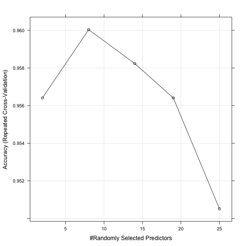
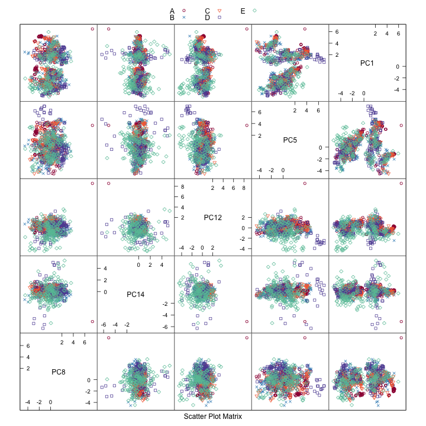

Study on Determining Quality of BarBell Lifts from Wearable Sensor Data
-----------------

## Summary

In this study we classify the quality of subject's barbell lifts from a series 
of calculated features.  The data is more-completely described with references at the following link, [http://groupware.les.inf.puc-rio.br/har](http://groupware.les.inf.puc-rio.br/har). There are five classes of quality given by the following: correct form (Class A), throwing the elbows to the front (Class B), lifting the dumbbell only halfway (Class C), lowering the dumbbell only halfway (Class D) and throwing the hips to the front (Class E).  The features are calculated from measurements of accelerometers that were located on the belt, forearm, arm, and dumbell of 6 participants.  We performed preprocessing steps and then trained a Random Forest classification algorithm to predict the classes based on the features. In the following document we describe the Data Analysis, i.e. loading, preprocessing, and training, that was performed, and then we describe the results with some illustrations.     


# Data Analysis

In this section we describe the initial dataset, the preprocessing steps that were performed, and the training that was performed on the data for the Random Forest classification algorithm.  

## Data Description

The original dataset has 19,622 samples in the training set with 160 columns.  The last column
refers to the samples the classe type.  The testing set consisted of 20 samples, but the classe variable was not known.  The first 7 columns consist of simple information: index number, user name, time stamps, and time-window information.  The next 152 columns are features based on measurements from the accelerometers.  These features are calculated over time windows and include types such as average, standard deviation, maximum, x,y,z-components, and kurtosis.  


## Preprocessing:

We performed the following preprocessing steps:

1.  We first removed several columns in the data that did not seem relevant to 
the prediction process these were the following: "X", "user_name",raw_timestamp_part_1",
"raw_timestamp_part_2", "cvtd_timestamp", "new_window", and "num_window"  
2. Remove columns with NAs
3. Remove the columns that have a DIV/0 as a factor variable
4. Perform Principal Component Analysis.

The first seven columns are removed.  There are 67 columns that are nearly all NAs, and there are 33 columns that have "DIV/0" in almost all the rows.  After these columns are removed we have 52 remaining features.  Following this we do PCA.  We keep components that help explain 95% of the variance.  This amounts to only 25 columns, i.e. 25 features to determine the classe of each sample.


```r
library(caret)
```

```
## Loading required package: lattice
## Loading required package: ggplot2
```

```r
# 1. Trim the data
ncol      <- dim(dat.train)[2]
dat.train <- dat.train[,c(8:ncol)]
dat.test  <-  dat.test[,c(8:ncol)]

# 2. Remove columns with NAs
num.nas   <- apply(dat.train, 2, function(x){length(which(is.na(x)))} )
inds      <- num.nas == 0
dat.train <- dat.train[,inds]
dat.test  <-  dat.test[,inds]    

# 3.  Remove the columns that have a DIV/0 as a factor variable
ncol      <- dim(dat.train)[2]
kep.col   <- rep(TRUE,ncol)
for (n in 1:ncol)
{
    if (any(grepl("#DIV/0!",dat.train[,n])) == TRUE)
    {            
        kep.col[n] <- FALSE
    }
}
dat.train <- dat.train[,kep.col]
dat.test  <-  dat.test[,kep.col]
ncol      <- dim(dat.train)[2]
    
# 4.  Perform Principal Component Analysis
preProc <- preProcess(dat.train[,1:(ncol-1)],method="pca", thresh = 0.95 )
dat.train <- cbind(
    predict(preProc,dat.train[,1:(ncol-1)]),
    classe = dat.train$classe)
dat.test <- cbind(
    predict(preProc,dat.test[,1:(ncol-1)]),
    problem_id = dat.test$problem_id)
```

## Prediction

Use a Random Forest classification algorithm to predict the classes of the 
of sample from the features.  Train the classification algorithm using 
10-fold cross-validation with 5 repitions.  Use 10 trees in the random
forest algorithm.  


```r
library(caret)
set.seed(23421197) # Set the random seed
fitControl <- trainControl(
    method = "repeatedcv",  ## Repeated Cross-validation
    number = 10,            ## 10 folds 
    repeats = 3)            ## 2 repitions
fit <- train(classe ~ .,data = dat.train, 
             method = "rf",
             tuneGrid = data.frame(mtry = round(seq(2,25,length = 5))),
             trControl = fitControl)
```

# Results

In this section we look at the training results and make a plot of a features.  We used a 10-fold Cross-validation training with 5 repititions.  Additionally, we varied the tuning parameter mtry, which is the number of variables randomly sampled at each split, from 2 to 25.  Below is a plot of the fit results.  


```r
print(fit)
```

```
## Random Forest 
## 
## 19622 samples
##    25 predictors
##     5 classes: 'A', 'B', 'C', 'D', 'E' 
## 
## No pre-processing
## Resampling: Cross-Validated (10 fold, repeated 3 times) 
## 
## Summary of sample sizes: 17659, 17660, 17659, 17661, 17659, 17660, ... 
## 
## Resampling results across tuning parameters:
## 
##   mtry  Accuracy  Kappa  Accuracy SD  Kappa SD
##   2     1         1      0.003        0.004   
##   8     1         1      0.003        0.004   
##   10    1         1      0.003        0.004   
##   20    1         1      0.003        0.004   
##   20    1         1      0.004        0.005   
## 
## Accuracy was used to select the optimal model using  the largest value.
## The final value used for the model was mtry = 2.
```


```r
library(ggplot2)
library(lattice)
trellis.par.set(caretTheme())
plot(fit)
```

 

```r
ggplot(fit)
```

 

The plot shows the average out-of-sample error for each tuning parameter across all the 10-fold and 5-repitions of the data.  We see the best results with a value of mtry = , and expect the testing accuracy to approximately %. 


Perform the prediction on the testing set


```r
train.pred <- predict(fit,newdata = dat.train)
test.pred  <- predict(fit,newdata = dat.test)
train.acc  <- mean(train.pred == dat.train$classe)
print(train.acc)
```

```
## [1] 1
```


```r
library(caret)
varimp.obj <- varImp(fit,scale = TRUE)
print(varimp.obj)
```

```
## rf variable importance
## 
##   only 20 most important variables shown (out of 25)
## 
##      Overall
## PC8    100.0
## PC12    90.7
## PC14    90.0
## PC1     85.9
## PC5     72.2
## PC3     68.8
## PC9     60.5
## PC2     59.0
## PC15    58.2
## PC6     57.5
## PC16    49.2
## PC21    48.6
## PC17    45.6
## PC7     43.9
## PC22    43.4
## PC10    43.0
## PC13    40.0
## PC25    37.4
## PC4     37.0
## PC20    31.0
```

```r
colnames(varimp.obj)
```

```
## NULL
```

```r
bst.ind <- order(varimp.obj$importance$Overall, decreasing = TRUE)
bst.ind <- bst.ind[1:5]
```


```r
smp.ind <- sample(dim(dat.train)[1], size=1000,replace=F)
featurePlot(x = dat.train[smp.ind, bst.ind],
            y = dat.train[smp.ind, dim(dat.train)[2]],
            plot = "pairs",
            ## Add a key at the top
            auto.key = list(columns = 3))
```

 


```r
preProc <- preProcess(dat.train[,2:(dim(dat.train)[2]-1)],method="pca", thresh = 0.95 )
    #     # Record the total number of features and the number needed to explain
    #     # 99% of the variance
print(preProc)
```

```
## 
## Call:
## preProcess.default(x = dat.train[, 2:(dim(dat.train)[2] - 1)], method
##  = "pca", thresh = 0.95)
## 
## Created from 19622 samples and 24 variables
## Pre-processing: principal component signal extraction, scaled, centered 
## 
## PCA needed 23 components to capture 95 percent of the variance
```
