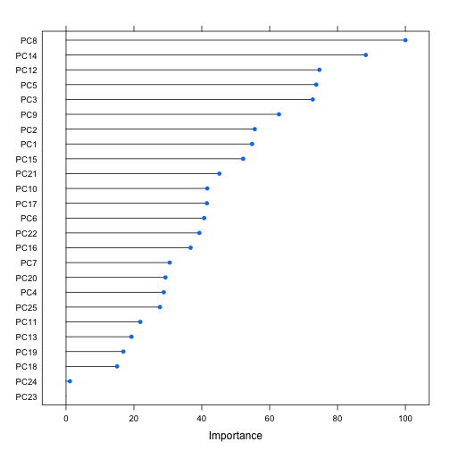

Study on Determining Quality of BarBell Lifts from Wearable Sensor Data
-----------------

## Summary

In this study we classify the quality of subject's barbell lifts from a series 
of calculated features.  The data is more-completely described with references at the following link, [http://groupware.les.inf.puc-rio.br/har](http://groupware.les.inf.puc-rio.br/har). There are five classes of quality given by the following: correct form (Class A), throwing the elbows to the front (Class B), lifting the dumbbell only halfway (Class C), lowering the dumbbell only halfway (Class D) and throwing the hips to the front (Class E).  The features are calculated from measurements of accelerometers that were located on the belt, forearm, arm, and dumbell of 6 participants.  We performed preprocessing steps and then trained a Random Forest classification algorithm to predict the classes based on the features. In the following document we describe the Data Analysis, i.e. loading, preprocessing, and training, that was performed, and then we describe the results with some illustrations.     


# Data Analysis

In this section we describe the initial dataset, the preprocessing steps that were performed, and the training that was performed on the data for the Random Forest classification algorithm.  

## Data Description

The original dataset has 19,622 samples in the training set with 160 columns.  The last column
refers to the samples the classe type.  The testing set consisted of 20 samples, but the classe variable was not known.  The first 7 columns consist of simple information: index number, user name, time stamps, and time-window information.  The next 152 columns are features based on measurements from the accelerometers.  These features are calculated over time windows and include types such as average, standard deviation, maximum, x,y,z-components, and kurtosis.  


```r
download.file("https://d396qusza40orc.cloudfront.net/predmachlearn/pml-training.csv", 
              destfile = "pml-training.csv", method="curl")
download.file("https://d396qusza40orc.cloudfront.net/predmachlearn/pml-testing.csv", 
              destfile = "pml-testing.csv", method="curl")
dat.train <- read.csv("pml-training.csv")
dat.test  <- read.csv("pml-testing.csv")
```

## Preprocessing:

We performed the following preprocessing steps:

1.  We first removed several columns in the data that did not seem relevant to 
the prediction process these were the following: "X", "user_name",raw_timestamp_part_1",
"raw_timestamp_part_2", "cvtd_timestamp", "new_window", and "num_window"  
2. Remove columns with NAs
3. Remove the columns that have a DIV/0 as a factor variable
4. Perform Principal Component Analysis.

The first seven columns are removed.  There are 67 columns that are nearly all NAs, and there are 33 columns that have "DIV/0" in almost all the rows.  After these columns are removed we have 52 remaining features.  Following this we do PCA.  We keep components that help explain 95% of the variance.  This amounts to only 25 columns, i.e. 25 features to determine the classe of each sample.


```r
library(caret)
```

```
## Loading required package: lattice
## Loading required package: ggplot2
```

```r
# 1. Trim the data
ncol      <- dim(dat.train)[2]
dat.train <- dat.train[,c(8:ncol)]
dat.test  <-  dat.test[,c(8:ncol)]

# 2. Remove columns with NAs
num.nas   <- apply(dat.train, 2, function(x){length(which(is.na(x)))} )
inds      <- num.nas == 0
dat.train <- dat.train[,inds]
dat.test  <-  dat.test[,inds]    

# 3.  Remove the columns that have a DIV/0 as a factor variable
ncol      <- dim(dat.train)[2]
kep.col   <- rep(TRUE,ncol)
for (n in 1:ncol)
{
    if (any(grepl("#DIV/0!",dat.train[,n])) == TRUE)
    {            
        kep.col[n] <- FALSE
    }
}
dat.train <- dat.train[,kep.col]
dat.test  <-  dat.test[,kep.col]
ncol      <- dim(dat.train)[2]
    
# 4.  Perform Principal Component Analysis
preProc <- preProcess(dat.train[,1:(ncol-1)],method="pca", thresh = 0.95 )
dat.train <- cbind(
    predict(preProc,dat.train[,1:(ncol-1)]),
    classe = dat.train$classe)
dat.test <- cbind(
    predict(preProc,dat.test[,1:(ncol-1)]),
    problem_id = dat.test$problem_id)
```

## Prediction

We use a Random Forest classification algorithm to predict the classes of the 
of sample from the features.  The training if the classification algorithm uses 
10-fold cross-validation with 5 repitions and varies the variable mtry from 2 to 25.
Additionally, we vary the number of trees used in the model from 5 to 15.  The caret and rf packages are used for the training and random forest implementation, respectively.  


```r
library(caret)
set.seed(23421197) # Set the random seed
fitControl <- trainControl(
    method = "repeatedcv",  ## Repeated Cross-validation
    number = 10,            ## 10 folds 
    repeats = 5)            ## 5 repitions
fit.5  <- train(classe ~ .,data = dat.train, ntree  = 5, 
             method = "rf", trControl = fitControl,
             tuneGrid = data.frame(mtry = round(seq(2,25,length = 5))) )
fit.10 <- train(classe ~ .,data = dat.train,ntree  = 10, 
             method = "rf", trControl = fitControl,
             tuneGrid = data.frame(mtry = round(seq(2,25,length = 5))) )
fit.15 <- train(classe ~ .,data = dat.train,ntree  = 15, 
             method = "rf", trControl = fitControl,
             tuneGrid = data.frame(mtry = round(seq(2,25,length = 5))) )
```

# Results

In this section we look at the training results and make a plot of a features.  We plot the accuracies versus the mtry, which is the number of variables randomly sampled at each split, and we also have a separate plot for each choose of the number of trees that we used.


```r
library(caret)
```

```
## Loading required package: lattice
## Loading required package: ggplot2
```

```r
library(ggplot2)
fit.res <- rbind(
    cbind(fit.5$results,  ntree = 5),
    cbind(fit.10$results, ntree = 10))
fit.res <- rbind(
    fit.res,      
    cbind(fit.15$results, ntree = 15))
fit.res$ntree <- as.factor(fit.res$ntree)
p <- ggplot(fit.res, aes(x = mtry, y = Accuracy, color = ntree))
p + geom_line()
```

 

The plot shows the average out-of-sample accuracy for each tuning parameter across all the 10-fold and 5-repitions of the data for 5, 10, and 15 trees.  We see the best results with a value of mtry equal to 8 and the number of trees being 15.  The expected testing accuracy, i.e. the average out-of-sample accuracy is 96.8%. 

Next we look at the importance of the variables in random forest algorithm.  The importance factor scaled to 100 is plotted below.  We see a smooth decrease from the most important to the least.  That is, it appears that most of these variables are actually necessary to classify the results.  

```r
varimp.obj <- varImp(fit.15,scale = TRUE)
```

```
## Loading required package: randomForest
## randomForest 4.6-7
## Type rfNews() to see new features/changes/bug fixes.
```

```r
plot(varimp.obj)
```

 

```r
bst.ind <- order(varimp.obj$importance,decreasing = TRUE)
bst.ind <- bst.ind[1:5]
```

Next, we perform a pair-wise plot depicting the relations between the first 5 most important variables.  This plot confirms that the classificaiton is non-trivial and most, if not all, of the variables are necessary to classify the data.  This is because we do not see any clear separation between the features from the 5 most important variables.  

```r
smp.ind <- sample(dim(dat.train)[1], size=1000,replace=F)
featurePlot(x = dat.train[smp.ind, bst.ind],
            y = dat.train[smp.ind, dim(dat.train)[2]],
            plot = "pairs",
            ## Add a key at the top
            auto.key = list(columns = 3))
```

 

In conclusion, it appears that machine learning techniques, specifically random forests, can perform quite well in determining if one does a barbell exercise correctly.  Although, the implemented method does not give much intuitive information about what aspects of the features differentiate the classes.
